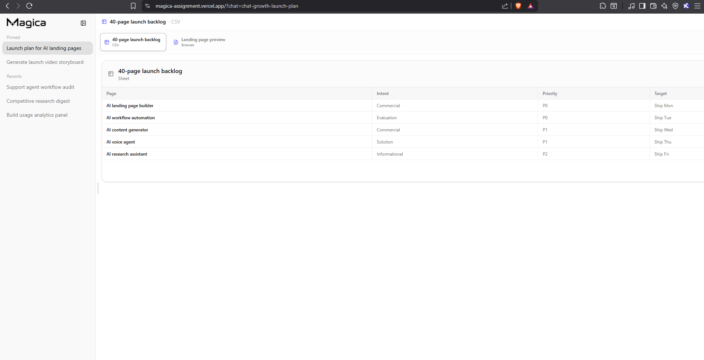
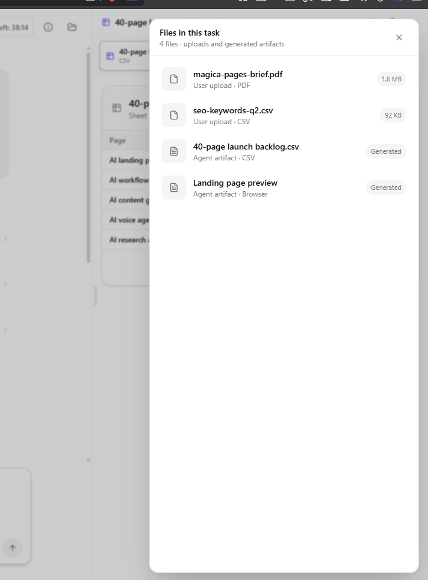
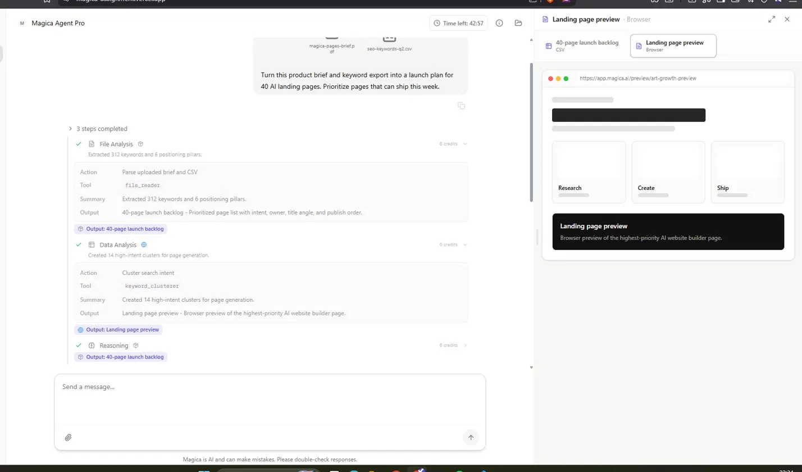
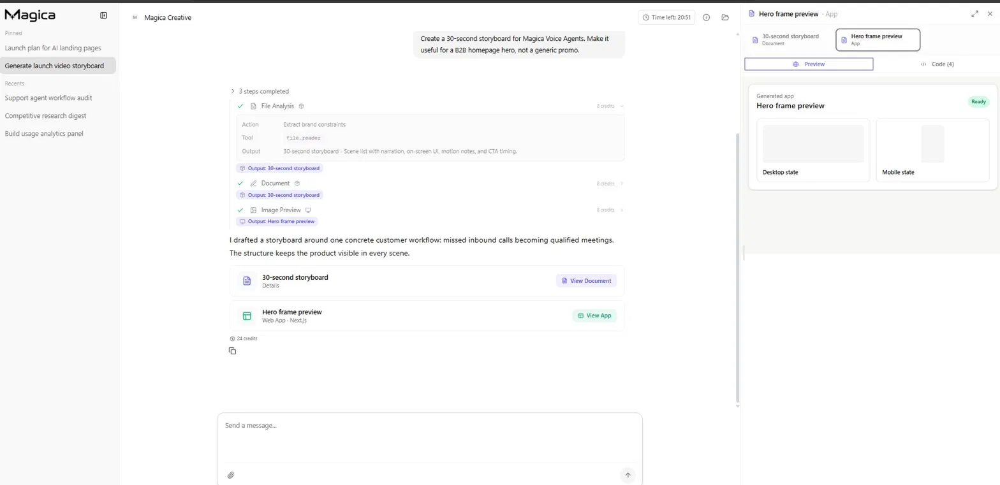
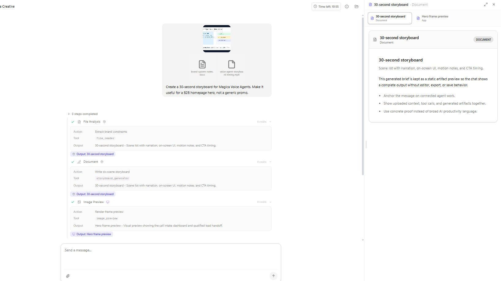
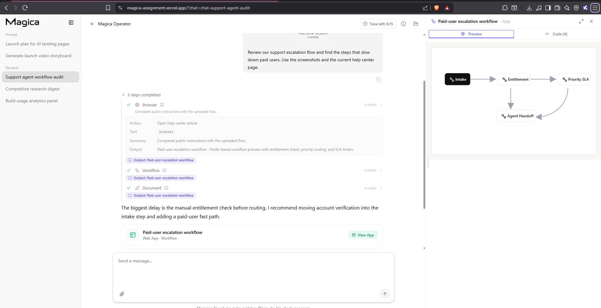
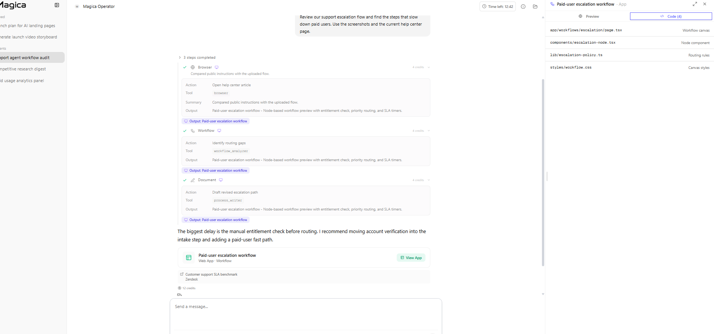
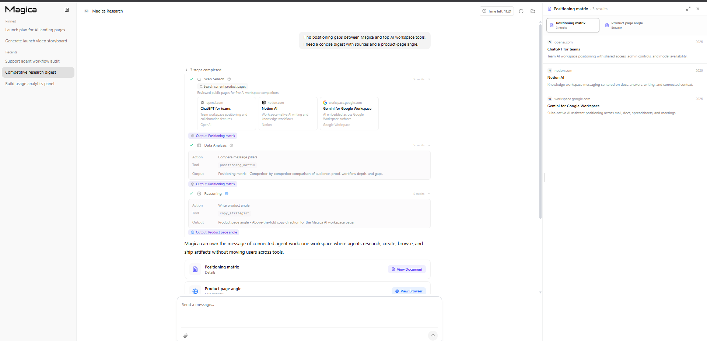
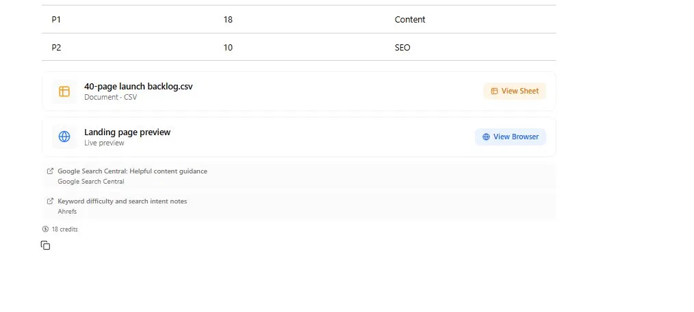

# Magica -  Bug Report

## Issues

### BUG-1 — Fullscreen Trap: no way back to chat

**Severity:** P1
**Affected:** All chats

Once a generated artifact/preview is opened in fullscreen, the cross, download, and fullscreen toggle buttons disappear. There is no navigation back to the chat itself. The reverse is also true, once you leave the artifact section mid-chat, you cannot reaccess it.

---

### BUG-2 — Logo click does not refresh or navigate home

**Severity:** P1
**Affected:** All chats

Clicking the Magica logo in the top-left does not trigger a page refresh or navigate to a home/dashboard state. Standard UX convention expects logo click to act as a home button.

---

### BUG-3 — No file access in task modal:

**Severity:** P1
**Affected:** All chats

The "Files in this task" modal lists all uploads and generated artifacts. However, individual file rows have no action to them, no download button, no open/preview option. The modal is just for showing only but with no functional access to any file.

---

### BUG-4 — Generated previews render skeleton divs

**Severity:** P0
**Affected:** Chat 1 (Landing page preview), Chat 2 (Hero frame preview)

All generated browser/app previews across multiple chats fail to render actual content. Only skeleton placeholder divs are shown indefinitely, not loading any apps as expected.

---

### BUG-5 — Several tool/output type mismatches: `keyword_clusterer` produces browser preview, `image_preview` produces Next.js web app

**Severity:** P1
**Affected:** Chat 1 Data Analysis step, Chat 2 Image Preview step

The `keyword_clusterer` tool is used to "Cluster search intent" but produces a browser preview artifact as output. A clustering tool should output structured data (intent groups, keyword clusters). Similarly various tools and outputs have mismatching types.

---

### BUG-6 — Multiple steps share identical output labels

**Severity:** P1
**Affected:** Chat 1 (Steps 1 & 3), Chat 2 (Steps 1 & 2), Chat 3 (all 3 steps)

Several chats show multiple workflow steps producing identically labelled outputs, making it impossible to distinguish what each step contributed. In Chat 3, all 3 steps output "Paid-user escalation workflow" with identical descriptions. This makes difficult to distinguish between the different steps and work done by the tools.

---

### BUG-7 — Agent accesses external URLs without instruction

**Severity:** P1
**Affected:** Chat 1 (Google Search Central, Ahrefs), Chat 3 (Zendesk)

The agent browsed external URLs (Google Search Central, Ahrefs, Zendesk) that were not referenced or requested in the task prompt. The tasks only involved user-uploaded files. Unsolicited external browsing is unexpected behavior that could introduce unverified data into agent outputs.

